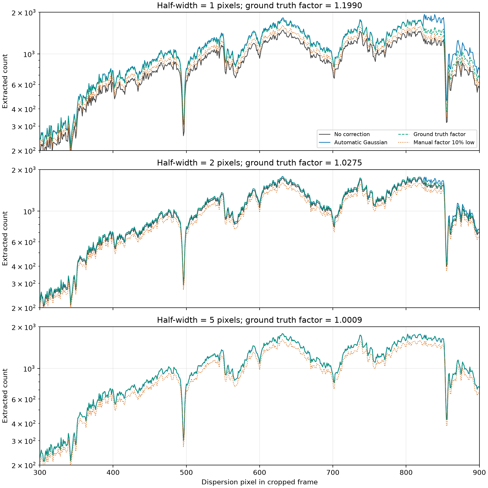
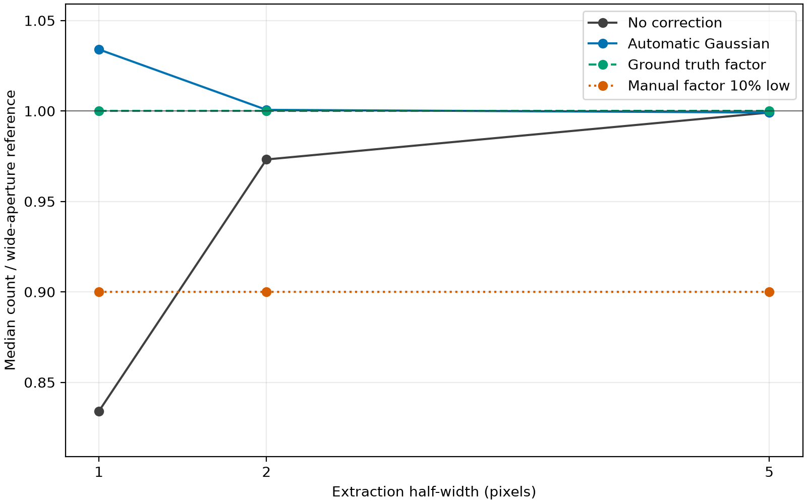
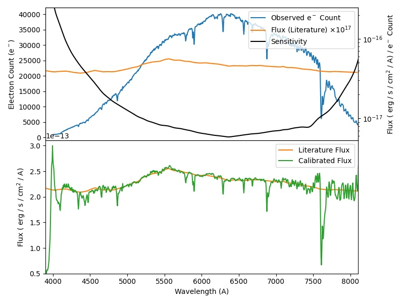

Flux Calibration
================

Aperture Flux Correction
------------------------
Horne86 extraction normalises the spatial profile over the supplied aperture.
Consequently, a narrow aperture, or any aperture that does not "fully" cover the
profile, returns the flux enclosed by that aperture rather than the total flux.
With ``model="gauss"``, a fitted Gaussian line-spread function
can estimate the missing flux fraction.

Set ``flux_correction=True`` to apply a pixel-wise correction from the Gaussian
cumulative distribution function during Horne86 extraction:

.. code-block:: python

  twodspec.ap_trace()
  twodspec.ap_extract(
     apwidth=1,
     optimal=True,
     algorithm="horne86",
     model="gauss",
     flux_correction=True,
  )

The default, ``flux_correction=False``, preserves aperture-enclosed flux. A
positive number supplies a fixed multiplicative correction and is available to
all extraction algorithms:

.. code-block:: python

  twodspec.ap_extract(
     apwidth=1,
     optimal=True,
     algorithm="horne86",
     model="gauss",
     flux_correction=1.12,
  )

The fixed factor scales both ``count`` and ``count_err``. It is useful when an
independent calibration supplies the aperture coverage, but it cannot follow
pixel-to-pixel changes in trace centring. Inspect the fitted Gaussian before
using automatic correction, especially for a non-Gaussian line-spread function.

Demonstration
~~~~~~~~~~~~~
The :download:`flux-correction plotting script <../../../other_scripts/flux_correction_demo.py>`
uses ``test/test_data/v_s_20180810_27_1_0_0.fits.gz`` to compare no correction,
automatic Gaussian correction, a ground truth factor calibrated against a
wide-aperture (10 pixels) reference, and a factor that is deliberately 10
percent too low for several extraction half-widths. The wide-aperture reference
only provides a known-correct factor for this demonstration. Run the script from
the repository with:

.. code-block:: bash

  python other_scripts/flux_correction_demo.py

Standard Stars
--------------
The flux and magnitude of the standard stars available in `iraf <https://github.com/iraf-community/iraf>`_ and on `ESO <https://www.eso.org/sci/observing/tools/standards/spectra.html>`_ are all included in this pakcage. We call these values the *template* hereafter.

Sensitivity Curve
-----------------
.. note::

  Sensitivity curves can only be computed if both the standard and observations are wavelength calibrated.

The sensitivity curve is the ratio of the real flux from the standard and the photoelectron count from the observation.
The higher resolution among the template and the observation is resampled to match the lower resolution one.
The template is divided by the continuum (with a lowess function) of the observed spectrum to generate the sensitivity curve which is
then interpolated by the ``scipy.interpolate.interp1d()``. A `Satvisky Golay smoothing
<https://docs.scipy.org/doc/scipy/reference/generated/scipy.signal.savgol_filter.html>`_ can be applied before the interpolation.

Masking
-------
Wavelength ranges can be masked when computing the sensitivity curve, for example, over the range of Telluric absorption lines.
The deafult masking ranges are 6850-6960, 7575-7700, 8925-9050 and 9265-9750 A. Then, 5 pixel on both side of the maskes will be
linearly interpolated to replace the masked values. They will then be replaced by the interpolated cvalues. All these numbers be customised.
The telluric mask provided can also be used to derive the telluric profile and then perform the telluric absorption correction.
