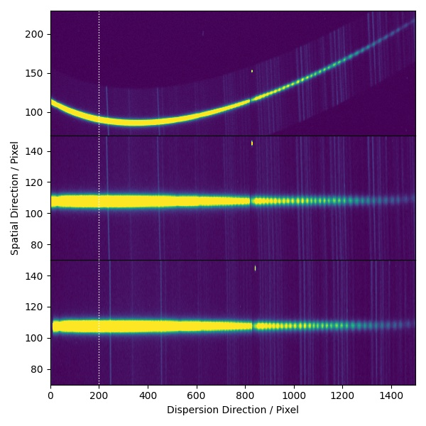

Image Rectification
===================

The rectification in the spatial direction depends only on the trace. Each column of pixel gets (scaled and) shifted by resampling to align with the centre of the spectrum. This will usually leave us with a spectrum tilted or curved in the dispersion direction. The same procedure as to trace the spectra is applied in the spatial direction to find the best fit polynomial solution for shifting (and scaling) in the dispersion direction for the last step of the rectification process. This step is not required for well-aligned long-slit spectra where the spatial and dispersion directions are aligned to the x-y axes of the detector.

The white dotted line shows is served as a visual guide for a line perpendicular to the dispersion direction.
