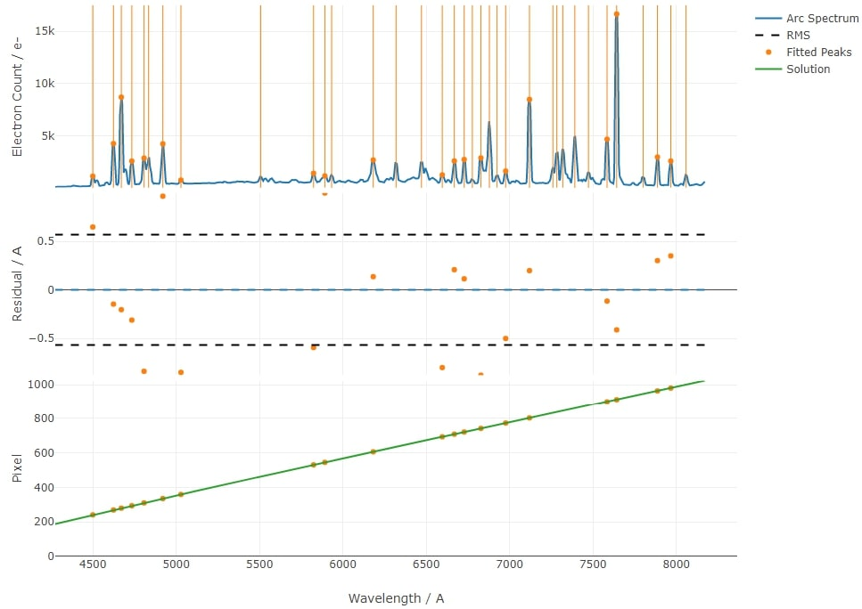

Wavelength Calibration
======================

ASPIRED implements wavelength calibration using `RASCAL <https://rascal.readthedocs.io/>`_. The simple setup should be sufficient for most low resolution spectrographs without crrsion unit in the instrument. For advanced usage of RASCAL or other wavelength calibration methods, it is possible to pass in polynomial coefficients. Currently, it supports ``numpy.polynomial.polynomial.polyval``, ``np.polynomial.legendre.legval`` and ``np.polynomial.chebyshev.chebval``.

An example diagnostic plot:

